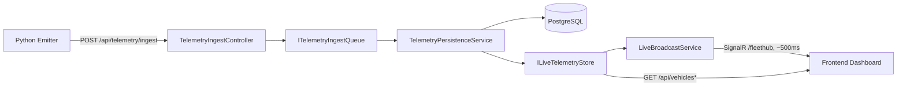

# Application Overview

> What this system is, how its pieces fit together, and how a telemetry reading travels from source to screen. For the formal spec, see [`docs/requirements/REQUIREMENTS.md`](requirements/REQUIREMENTS.md); for the sprint-by-sprint build history and process, see [`docs/SDD_WORKFLOW.md`](SDD_WORKFLOW.md).

---

## 1. What is this system

The IIoT Fleet Telemetry System is a real-time monitoring dashboard for 10,000+ industrial vehicles. It streams live telemetry — GPS position, fuel level, speed, temperature, engine health, cargo load — from the fleet's Python emitter to a web dashboard, updating each vehicle's state roughly twice a second. Operators use it to see fleet-wide status at a glance, get alerted when a vehicle crosses a danger/warning threshold, search/filter the fleet, and drill into any single vehicle's live gauges and recent event log.

The system's own status logic (`active`/`warning`/`danger`/`offline`) is deterministic — computed from raw metric thresholds, not manually set — so the dashboard's colors and counts always reflect the same rules documented in `REQUIREMENTS.md` §4.1.

## 2. Topology

```
┌─────────────┐        ┌──────────────┐        ┌───────────────┐
│  frontend   │◄──────►│   backend    │◄──────►│  PostgreSQL    │
│  Next.js 15 │  HTTP  │ ASP.NET Core │  EF     │  (db)          │
│  :3000      │  +     │  8 Web API   │  Core   │  :5432         │
└─────────────┘  Sig-  │  :8080       │        └───────────────┘
                 nalR   └──────┬───────┘
                                │ HTTP POST
                        ┌────────────────┐
                        │  emitter       │
                        │  Python client │
                        └────────────────┘
```

- **Frontend** (`frontend/`) — Next.js 15 App Router dashboard. Opens one SignalR connection per session (`frontend/app/page.tsx`), holds live vehicle state in a `useRef<Map>` for O(1) per-vehicle updates, and renders the sidebar, map, and detail panel from that state via Zustand stores.
- **Backend** (`backend/`) — ASP.NET Core 8 Web API. Owns the SignalR hub (`/fleethub`), the REST endpoints under `/api/`, the Swagger UI (`/swagger`), and the live-ingestion pipeline that is the sole source of vehicle state.
- **Database** — PostgreSQL, reached via EF Core (`FleetDbContext`). Stores the `vehicles`, `telemetry_snapshots`, and `vehicle_logs` tables (see `REQUIREMENTS.md` §6).
- **emitter** — a standalone Python client that POSTs telemetry readings to the backend's ingest endpoint, simulating what a real fleet's edge devices would do.

All services communicate over the Docker Compose network `iiot-fleet-net` (see [`docs/devops-learn/Docker_Compose.md`](devops-learn/Docker_Compose.md) for how that's wired) or, in Kubernetes, via the `Service` objects the Helm chart renders (see [`docs/devops-learn/K8s.md`](devops-learn/K8s.md) and [`docs/HELM_GUIDE.md`](HELM_GUIDE.md)).

## 3. The live-only pipeline

The backend runs a single, always-on data-flow path — there is no dummy/simulated-mode branch. All vehicle state originates from telemetry actually POSTed to the backend by `emitter` (or any other client speaking the same ingest contract), with status computed server-side per-reading and persisted.

## 4. Data Flow

The diagram below distinguishes the **write path** — the one-way journey a telemetry reading takes from the emitter through validation, queuing, persistence, and broadcast, ending as a SignalR push to every connected dashboard — from the **read path**, which is a plain synchronous REST read: `GET /api/vehicles` and `GET /api/vehicles/{id}` (and `/metadata`) answer directly from `ILiveTelemetryStore`'s current in-memory state, with no queue and no direct database round-trip on the request. The write path is what keeps the store fresh; the read path is how the frontend (or any external client) can fetch a point-in-time snapshot without opening a SignalR connection at all. Both paths read/write the same `ILiveTelemetryStore` instance, so a REST read always reflects the latest broadcast state.



Step by step: `emitter` fetches the real vehicle roster from `GET /api/vehicles/metadata` (never invents vehicle IDs) and periodically POSTs one reading per vehicle to `POST /api/telemetry/ingest`. `TelemetryIngestController` validates the payload, computes status via `VehicleStatusEvaluator.Evaluate` (matching `REQUIREMENTS.md` §4.1's offline → danger → warning → active priority), and enqueues it onto `ITelemetryIngestQueue` — it never calls `SaveChangesAsync` synchronously, so ingest requests stay fast. `TelemetryPersistenceService` drains that queue, writes `telemetry_snapshots`/`vehicle_logs` rows to PostgreSQL in the background, and updates `ILiveTelemetryStore`. `LiveBroadcastService` then picks up current state from `ILiveTelemetryStore` and broadcasts it over the SignalR hub (`/fleethub`), MessagePack-serialized, roughly every 500ms, to every connected `frontend/app/page.tsx` session. Separately, `TelemetryRetentionService` runs on a schedule and deletes `telemetry_snapshots` rows older than a configurable retention window, in batches, so the table doesn't grow unbounded.

## 5. Where status and alerts are decided

Two distinct things are easy to conflate:

- **`status`** (`active`/`warning`/`danger`/`offline`) — computed **server-side**, deterministically, from the thresholds in `REQUIREMENTS.md` §4.1. This is what colors the sidebar dots and map markers.
- **Frontend alert thresholds** (`REQUIREMENTS.md` §4.3) — a *separate*, looser set of conditions (fuel < 20%, temp > 65°C, speed > 80 kph, engineHealth < 15) that the frontend checks independently to decide when to fire a toast notification. A vehicle can be server-side `active` and still trigger a frontend alert, or vice versa — the two systems are intentionally decoupled.

## 6. Glossary / file index

| Concept | Where to look |
|---------|---------------|
| Agent roles, write-scopes, service topology | [`AGENTS.md`](../AGENTS.md) |
| Full functional/non-functional spec | [`docs/requirements/REQUIREMENTS.md`](requirements/REQUIREMENTS.md) |
| Sprint-by-sprint build process | [`docs/SDD_WORKFLOW.md`](SDD_WORKFLOW.md) |
| Docker/Compose concepts + this project's usage | [`docs/devops-learn/Docker_Compose.md`](devops-learn/Docker_Compose.md) |
| Helm concepts + this project's chart | [`docs/devops-learn/Helm.md`](devops-learn/Helm.md) |
| Kubernetes concepts + this project's chart | [`docs/devops-learn/K8s.md`](devops-learn/K8s.md) |
| Helm install/upgrade operational steps | [`docs/HELM_GUIDE.md`](HELM_GUIDE.md) |
| Status evaluation | `backend/Services/VehicleStatusEvaluator.cs` |
| Ingest endpoint | `backend/Controllers/TelemetryIngestController.cs` |
| SignalR hub | `backend/Hubs/FleetHub.cs` (`/fleethub`) |
| Frontend SignalR entry point + state | `frontend/app/page.tsx` |
